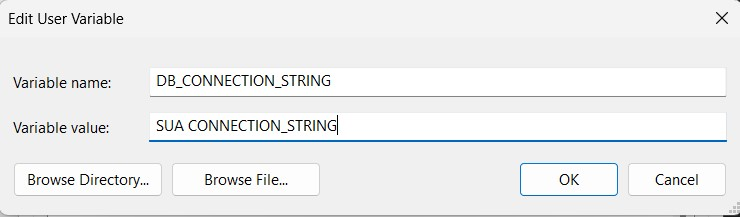
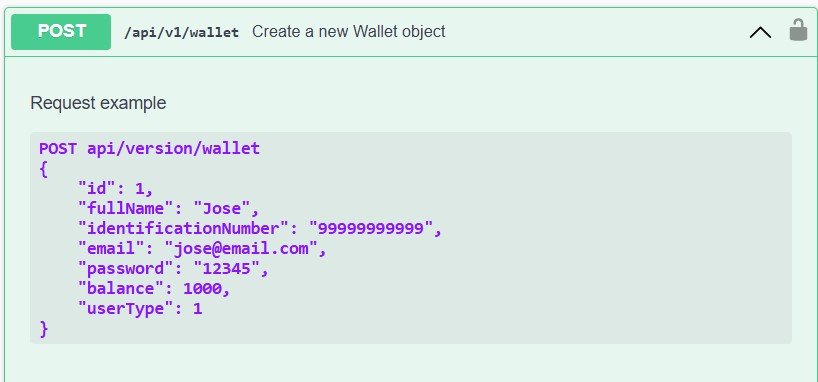
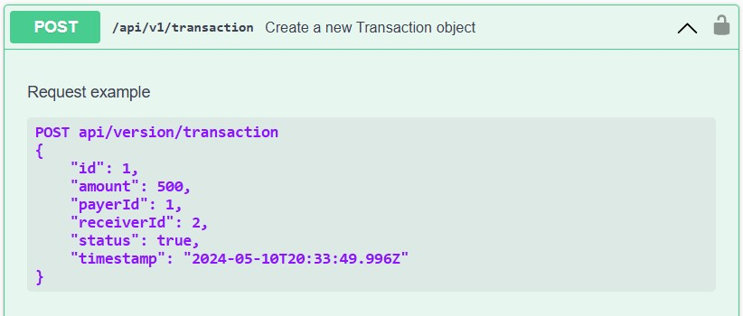
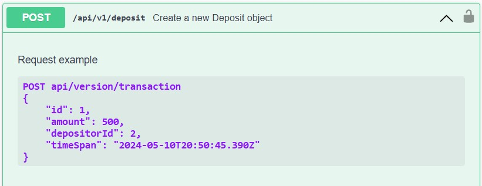
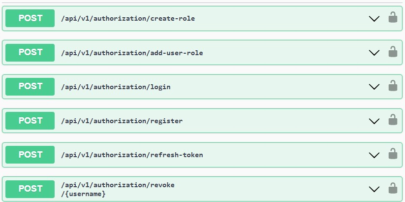

# SimpliPayApi
Projeto para colocar em prática os conhecimentos obtidos em treinamentos e estudos sobre Web API ASP.NET Core.

A ideia surgiu em replicar o Desafio Back-End proposto pela [PickPay](https://github.com/PicPay/picpay-desafio-backend). A ideia é um plataforma de pagamento simplificado para realizar depósitos e transferência de valores entre usuários, onde existem 2 tipos de usuários (usuários comuns e lojistas) e ambos tem carteira com dinheiro e realizam transferências.

## Requisitos
- Para ambos tipos de usuário, precisamos do Nome Completo, CPF, e-mail e Senha. CPF/CNPJ e e-mails devem ser únicos no sistema. Sendo assim, seu sistema deve permitir apenas um cadastro com o mesmo CPF ou endereço de e-mail;

- Deve existir a possibilidade de cadastro, consulta, atualização e remoção da carteira (CRUD básico);

- Os usuários podem realizar depósitos na própria carteira e consultar os seus saudos;

- Usuários podem enviar dinheiro (efetuar transferência) para lojistas e entre usuários e cosultar as transferências realizadas;

- Lojistas só recebem transferências, não enviam dinheiro para ninguém;

- Validar se o usuário tem saldo antes da transferência;

- Antes de finalizar a transferência, deve-se consultar um serviço autorizador externo, utilizando um [mock](https://run.mocky.io/v3/84fc75f8-7f16-4eff-98e0-2be9d48fea3c) criando por mim;

- A operação de transferência deve ser uma transação (ou seja, revertida em qualquer caso de inconsistência) e o dinheiro deve voltar para a carteira do usuário que envia;

- Após a efetivação da transação o usuário recebedor do pagamento dever receber um e-mail informando que uma transação foi realizada para ele;

- Somente usuários autenticados e autorizados por um perfil de usuário padrão, podem realizar transações e consultar saldos e transações.

## Temas abordados
- Mapeamento Utilizando Fluent API do EF Core.
- Padrão Repositório Genérico
- Tratamento Global de Exceção
- Log Customizado
- Paginação e Filtro nos Endpoints
- Programação assíncrona
- Autenticação, Altorização e Token JWT
- Versionamento de API
- Documentação com Swagger
- Utilizando envio de email na API (Utilizei [Sendgrid](https://sendgrid.com/en-us) como SMTP)

## Tecnologias
- [C#](https://learn.microsoft.com/en-us/dotnet/csharp/)
- [ASP.NET Core 8](https://learn.microsoft.com/en-us/aspnet/core/?view=aspnetcore-8.0)
- [Entity Framework Core 8.0](https://learn.microsoft.com/en-us/ef/)
- [SQL Server](https://www.microsoft.com/en-us/sql-server/sql-server-downloads)
- [Swagger](https://swagger.io/)

## Requisitos
- [.NET SDK 8](https://dotnet.microsoft.com/en-us/download)
- [Docker Desktop](https://www.docker.com/products/docker-desktop/)
- [Azure Data Studio](https://learn.microsoft.com/en-us/azure-data-studio/download-azure-data-studio?tabs=win-install%2Cwin-user-install%2Credhat-install%2Cwindows-uninstall%2Credhat-uninstall)
- IDE ou Editor de Código da sua escolha

## Docker Desktop com SQL Server
Obtendo imagem oficial SQL Server para um container Docker 

```powershell
docker pull mcr.microsoft.com/mssql/server:2022-latest
```

Rodando o SQL Server
```powershell
docker run --name sqlserver -e "ACCEPT_EULA=Y" -e "MSSQL_SA_PASSWORD=1q2w3e4r@#$" -p 1433:1433 -d mcr.microsoft.com/mssql/server:2022-latest
```

## Pacotes instalados
- [Swashbuckle.AspNetCore - Versão 6.6.1](https://www.nuget.org/packages/Swashbuckle.AspNetCore/6.6.1)
- [Microsoft.EntityFrameworkCore.SqlServer - Versão 8.0.5](https://www.nuget.org/packages/Microsoft.EntityFrameworkCore.SqlServer/8.0.5/)
- [Microsoft.EntityFrameworkCore.Design - Versão 8.0.5](https://www.nuget.org/packages/Microsoft.EntityFrameworkCore.Design/8.0.5/)
- [Microsoft.EntityFrameworkCore - Versão 8.0.5](https://www.nuget.org/packages/Microsoft.EntityFrameworkCore/8.0.5/)
- [Microsoft.AspNetCore.Identity.EntityFrameworkCore - Versão 8.0.5](https://www.nuget.org/packages/Microsoft.AspNetCore.Identity.EntityFrameworkCore/8.0.5/)
- [Microsoft.AspNetCore.Authentication.JwtBearer - Versão 8.0.5](https://www.nuget.org/packages/Microsoft.AspNetCore.Authentication.JwtBearer/8.0.5/)
- [MailKit - Versão 4.6.0](https://www.nuget.org/packages/MailKit/4.6.0)
- [Asp.Versioning.Mvc.ApiExplorer - Versão 8.1.0](https://www.nuget.org/packages/Asp.Versioning.Mvc.ApiExplorer/8.1.0)

## Configurações
#### `appsettings.json`
```C#
{
  "Logging": {
    "LogLevel": {
      "Default": "Information",
      "Microsoft.AspNetCore": "Warning"
    }
  },
  "JWT": {
    "ValidAudience": "http://localhost:7066",
    "ValidIssuer": "http://localhost:5066",
    "SecretKey": "YourSecretKey",
    "TokenValidityInMinutes": 30,
    "RefreshTokenValidityInMinutes": 60
  },
  "SMTP": {
    "Host": "smtp.sendgrid.net",
    "Port": 587,
    "UserName": "apikey",
    "Password": "YourPassword"
  },
  "AllowedHosts": "*"
}
```
### Utilizando a Variável de Ambiente como Connection String


```C#
builder.Services.AddDbContext<AppDbContext>(options => options.UseSqlServer(Environment.GetEnvironmentVariable("DB_CONNECTION_STRING")));
```

## Controladores e Endpoints
### Wallet





### Transaction



### Deposit



### Auth
Controlador criado para realizar a implementação da autenticação e autorização na API:
- Criar perfil de usuário
- Associar usuário ao perfil
- Realizar Login
- Criar usuário
- Atualizar o Token JWT
- Cancelar acesso do usuário
 


# Habilidades
- C#
- .NET 8
- ASP.NET Web API
- Entity Framework
